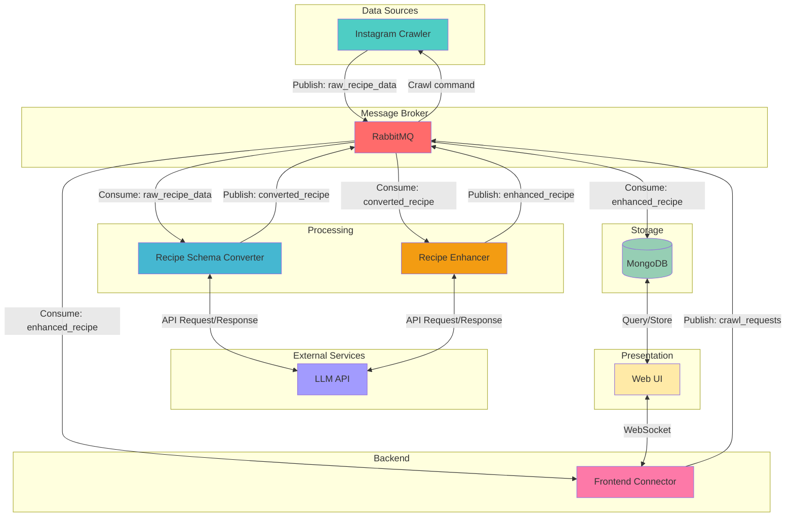

# recify

A recipe management system with event-driven architecture for crawling, processing, and storing recipes from Instagram.

## Architecture Overview

The system follows an event-driven architecture using RabbitMQ as the central message broker:

## Components

### Instagram Crawler
Scrapes recipe content from Instagram and publishes raw data to RabbitMQ.

### RabbitMQ
Central message broker handling asynchronous communication between components.

### Recipe Schema Converter
Processes raw recipe data and converts it into a standardized schema format using an external LLM API for intelligent extraction and structuring.

### Recipe Enhancer
Analyzes converted recipes and intelligently fills in missing information according to the Schema.org Recipe specification. Uses LLM API to add critical missing fields such as preparation time, cooking time, recipe yield, recipe category, cuisine type, cooking method, and nutritional information. Publishes enhanced recipes with complete metadata to RabbitMQ.

### LLM API
External language model service accessed via API to parse and structure unstructured recipe data into standardized format.

### MongoDB
Persistent data storage for processed recipes.

### Frontend Connector
WebSocket server that bridges the Web UI and RabbitMQ. Receives crawl requests from the frontend via WebSocket and publishes them to RabbitMQ. Consumes converted recipes from RabbitMQ and forwards them to connected clients in real-time.

### Web UI
User interface for browsing recipes and triggering crawl operations.